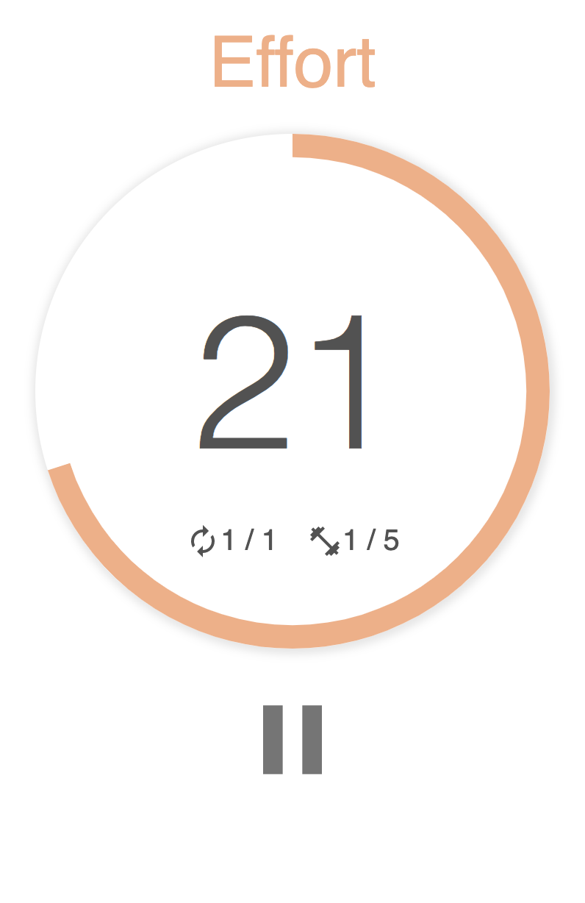

**My Tabata** is an application intended primarily for athletes who use the Tabata method. The purpose of this method is 20 seconds of intense exercise followed by 10 seconds of recovery, you have to repeat it 8 times for a total training of 4 minutes. With **My Tabata** you can adapt your training: Set your working time, the number of exercices, the number of cycles,... Configure your timer as you want !

This project was bootstrapped with [Create React App](https://github.com/facebook/create-react-app).
